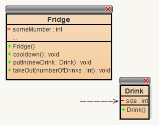
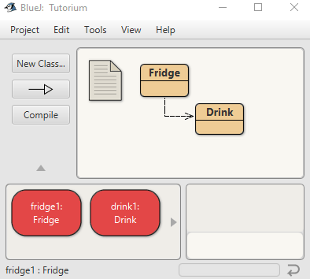

# ExampleRepo
Just showing how a repo maybe should look like.
Usually, here is where you have a short description what your app stored in this repo (short for repository; which is a term for ["safe storage space"](https://en.wiktionary.org/wiki/repository)) is about. The Readme is written in [Markdown markup language](https://en.wikipedia.org/wiki/Markdown).

You may also list main features and screenshots here. but the ultimate design is up to you. Take a look at other, maybe professional repos, and get inspiration hot to set up yours.

VSCode is a great tool for editing md-files, as it also lets you preview the result as it will be in your repo (at least in most cases!).

# Quickstart
Often, the next section is about "How to run the programm?". This is also often describing the easiest or most common way to run your app - it may not be suitable for everyone and include all the possible details. May also require links to external apps, done with "[Text to show] (Link in parenthesis)" - as soon as the ] and ( touch the link is created and the brackets disappear: [Text to show](LinkInParenthesis)

## Subsection to Quickstart

Just showing that you can do subsections of subsections, too.

### sub-Subsection

#### Each of them is just done by having more hastags (#) before the headline.

##### Knock yourself out with structure (but usually won't go deeper than 3 levels!)

# Build
Sometimes your app needs to be built from the source code and cannot be just ron from the get go. Include instructions how to build it for various platforms.

- Step 1
- Some more
- and more

# Contribution
Maybe you allow others to contribute to your project. Then here is where you would write some guidelines or how to get further infrmation how to to that and what to keep in mind (styles, quality, used tech etc.)

# License
Finally, there's often an additional mentioning of the license used for the project (yes, actually even you should have one for your own private stuff!), even though it may be already part of the repo files.

# Contact / Author / Credits / Something Else
You may include as many Sections and Subsections as you want. The order doesn't matter either. These are just suggestions.